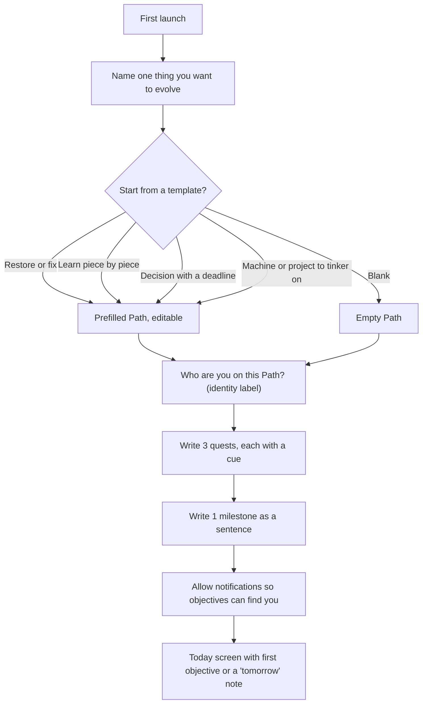
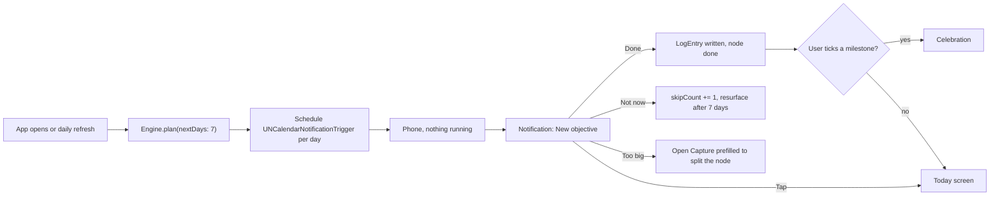
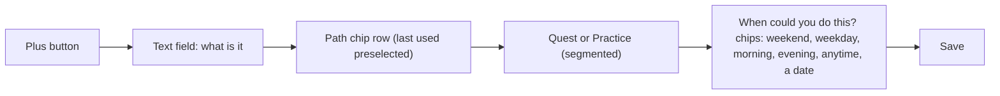
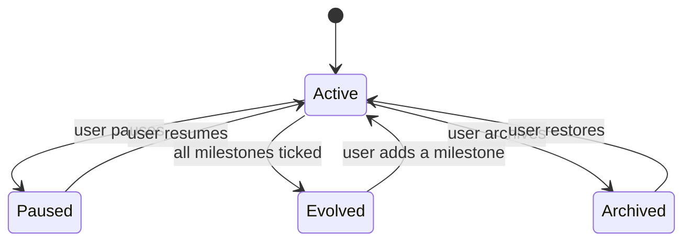
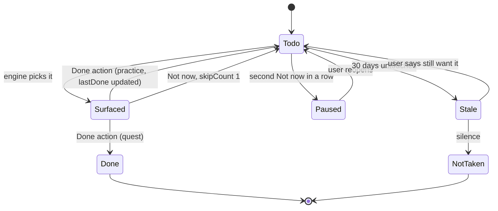

# Screens and flows

Six screens. Navigation is a tab bar with two tabs, Today and Paths. Everything else is a sheet or a push from those two.

## Screen inventory

| Screen | Purpose | Entry | Exit |
|---|---|---|---|
| Today | Show today's one objective, or the reason there is none. Done / Not now / Too big. | Tab, notification tap, widget tap | Capture sheet, Path detail |
| Paths | List of Paths with glyph, identity, milestone progress as ticks, quiet state (evolved, paused). | Tab | Path detail, Capture (new Path) |
| Path detail | Milestones as an ordered strip, nodes grouped as quests and practices, log entries below. Edit in place. | Paths list, Today card title | Capture (new node), Celebration |
| Capture | One text field. Which Path, quest or practice, when could you do this (cue chips). Three taps to save. | Plus button anywhere | Back to caller |
| Celebration | Full-screen moment when a milestone is ticked. Glyph animates, identity label, the milestone sentence. One button. | Ticking a milestone | Path detail |
| Settings | Notification permission, quiet hours, morning and evening window times, role defaults, JSON export (phase 2). | Gear on Paths | Back |

## Onboarding flow

## Daily flow

## Capture flow

## Path lifecycle

## Node lifecycle

## Notification anatomy

Title: the Path identity, e.g. "Guitarist". Body: "New objective: change the strings". Category `objective` with three actions. `done` (foreground optional), `later` (background), `toobig` (foreground). Thread identifier is the Path id so one Path's objectives stack.
