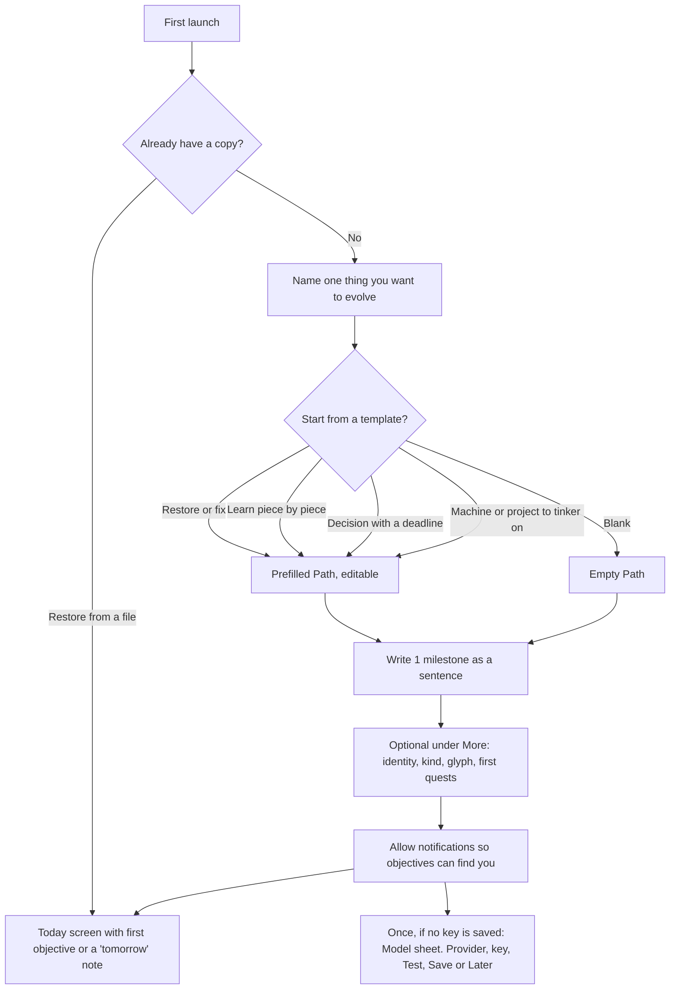
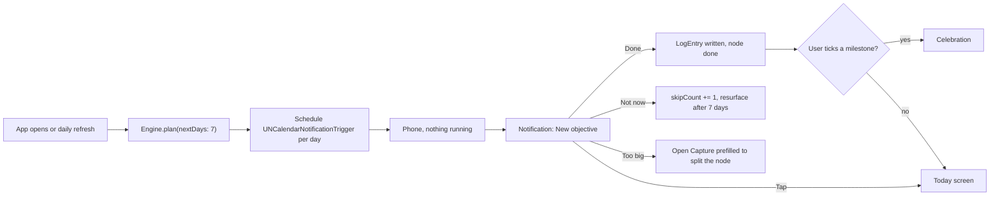
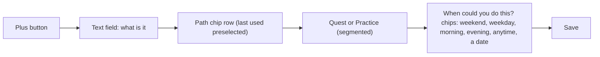
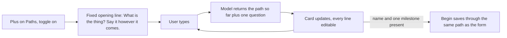
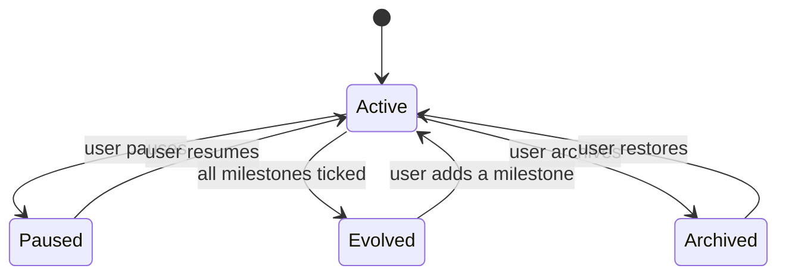
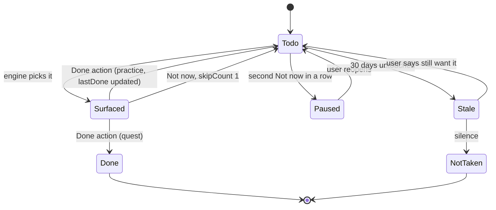

# Screens and flows

Thirteen screens. Navigation is a tab bar with two tabs, Today and Paths. Everything else is a sheet or a push from those two.

## Screen inventory

| Screen | Purpose | Entry | Exit |
|---|---|---|---|
| Today | Quests and practices due today. Centered live clock and sort stay pinned. Quests, Practice, or When as a list. Swipe right or tap a row to mark done. | Tab, notification tap | Path detail, Capture |
| Paths | World or list. World: you in the middle, paths as orbs, quests and practices as twigs. Tap once to glow from You, tap again to open, tap You to clear. List: the original rows. | Tab | Path detail, Capture (new Path) |
| Path detail | Milestones as an ordered strip, nodes grouped as quests and practices, log entries below. Tap the header or Edit to change the path itself. Tap an unticked milestone to mark it true today. Tap a ticked one to change the day or take the tick back, with a confirm. Tap a node to edit its words, cue, or blocker; swipe to let it go. | Paths list, Today card title | Path editor, The fact, Capture (new node), Node editor, Celebration |
| The fact | Day a milestone became true, Keep it, or It was not true yet (confirm). | Tapped ticked milestone | Path detail |
| This path | Name, identity, kind, glyph, deadline, milestone wording and order. Save writes through `Store.update`. Ticks stay. | Path detail header or Edit | Path detail |
| New path | Name and one milestone, then Begin. Templates in a one-tap menu. Identity, kind, glyph, and first quests under a collapsed More row. | Plus on Paths, onboarding | Paths |
| Talk a path | Same result as New path, by conversation. The owner's cloud model (OpenAI or Anthropic, their key) asks one short question at a time and writes down what the user said. A live card shows the path so far, every line editable. Begin saves it. Only when a key is saved; the Settings toggle decides whether it opens first, and each surface offers the other. | Plus on Paths, "Talk it through instead" on New path | Paths, or Type it instead |
| Model | Provider, key, model name, Test, Save, Remove key. Key in the keychain. | Settings, "Add an API key" on New path, once as a sheet after onboarding when no key is saved (Later skips) | Back |
| Capture | One text field. Which Path, quest or practice, when could you do this (cue chips). Three taps to save. | Plus button anywhere | Back to caller |
| Celebration | Full-screen moment when a milestone is ticked. Glyph animates, identity label, the milestone sentence. One button. | Ticking a milestone | Path detail |
| Settings | Notification permission, quiet hours, morning and evening window times, role defaults, create paths by talking, keep a copy in Files, save world.json, restore from a file, The words. | Gear on Paths | Back |
| The words | Cheat sheet for Path, Milestone, Quest, Practice, Cue, Today, Evolved, The fact. | Settings, New path “What is a milestone?”, question mark on New path | Back |

## Onboarding flow

## Daily flow

## Capture flow

## Talk flow

## Path lifecycle

## Node lifecycle

## Notification anatomy

Title: the Path identity, e.g. "Guitarist". Body: "New objective: change the strings". Category `objective` with three actions. `done` (foreground optional), `later` (background), `toobig` (foreground). Thread identifier is the Path id so one Path's objectives stack.
